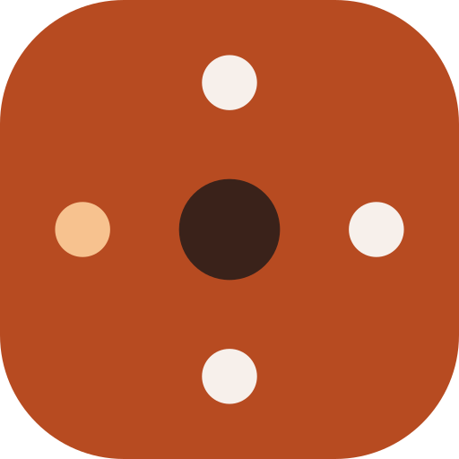

This is a [Next.js](https://nextjs.org/) project bootstrapped with [`create-next-app`](https://github.com/vercel/next.js/tree/canary/packages/create-next-app).

## Getting Started

First, run the development server:

```bash
npm run dev
# or
yarn dev
# or
pnpm dev
# or
bun dev
```

Open [http://localhost:3000](http://localhost:3000) with your browser to see the result.

You can start editing the page by modifying `app/page.tsx`. The page auto-updates as you edit the file.

This project uses [`next/font`](https://nextjs.org/docs/basic-features/font-optimization) to automatically optimize and load Inter, a custom Google Font.

## Learn More

To learn more about Next.js, take a look at the following resources:

- [Next.js Documentation](https://nextjs.org/docs) - learn about Next.js features and API.
- [Learn Next.js](https://nextjs.org/learn) - an interactive Next.js tutorial.

You can check out [the Next.js GitHub repository](https://github.com/vercel/next.js/) - your feedback and contributions are welcome!

## Environment Variables

Copy `.env.example` to `.env.local` and fill in the values. All variables listed there are required for a full deployment except `ACCESS_PASSWORD`.

Production and preview/local deployments use **separate Clerk instances and separate MongoDB databases** — see [`docs/environments.md`](./docs/environments.md) for the split and for the steps to take Clerk to production.

## Brand and icons



The mark is the **clock die**: four pips at 12, 3, 6 and 9 — a die face and a
clock face at once — with the brass pip marking the seat in play.

| Token | Hex | Used for |
|---|---|---|
| `--ag-terracotta` | `#b74b21` | the die body |
| `--ag-on-dark` | `#f7f0eb` | the three cream pips |
| — (brass) | `#f7c28f` | the live-seat pip at 9 |
| `--ag-dark` | `#3a221a` | the hub |

Every measurement is a fraction of the box, so the mark redraws cleanly at any
size. As the box shrinks the pips grow and their inset tightens so they don't
dissolve, and below 24px the hub drops entirely — four dots in a rounded square
still read as both die and clock at 16px.

### Regenerating the assets

`scripts/generate-icons.mjs` is the only place the mark is drawn. Edit the
geometry or colours there and re-run:

```bash
npm run icons
```

That rewrites every shipped image of the mark:

| File | Where it's used |
|---|---|
| `src/app/favicon.ico` | browser tab (16/32/48, each drawn at its own size tier) |
| `src/app/apple-icon.png` | iOS home screen |
| `public/icons/icon.svg` | the manifest's scalable icon, and the copy `Brand` renders on screen |
| `public/icons/icon-192.png`, `icon-512.png` | PWA install |
| `public/icons/maskable-512.png` | Android adaptive icon |
| `public/icons/mstile-150.png` | Windows tile (`public/icons/browserconfig.xml`) |
| `public/icons/og-image.png` | `og:image` / `twitter:image` share card |
| `android/app/src/main/res/mipmap-*/ic_launcher*.png`, `values/ic_launcher_background.xml` | the Capacitor Android app's launcher icon (legacy + adaptive, every density) |
| `android/app/src/main/res/drawable{,-port,-land}-*/splash.png` | the Android app's launch screen |

The share card is the only asset that needs anything extra: it sets the
wordmark in Bricolage Grotesque, so that font must be installed as a system
font or the script skips it with a warning and leaves the existing card in
place. Its words and its size come from `src/utils/app.ts` — the same
constants the page's own description and `og:image` dimensions are built from,
so the picture and the text a chat app sets beside it always agree.

On screen, use the `Brand` component (`src/components/ui/Brand.tsx`) — the mark
and wordmark locked up together — anywhere a top bar names the app. Screens
showing a *page* title instead (e.g. Profile, Settings, The library, Result)
keep their own `ag-wordmark` span.

## Cron / Turn Timer

The turn-timer cron job runs at `/api/cron/turntimer`. It checks all active games, advances any expired turns, and sends push notifications.

**Why an external cron service?**  
Vercel Hobby plan limits cron jobs to once per day. Since the shortest supported turn timer is 12 hours, a daily Vercel cron (`0 0 * * *` in `vercel.json`) acts only as a backstop. For reliable sub-day enforcement use a free external scheduler such as [cron-job.org](https://cron-job.org).

**Setting up cron-job.org:**

1. Create a free account at [cron-job.org](https://cron-job.org).
2. Add a new cron job with:
   - **URL:** `https://asyncgames.com/api/cron/turntimer`
   - **Schedule:** every 15 minutes (or whatever granularity you need)
   - **Request method:** GET
   - **Header:** `Authorization: Bearer <CRON_SECRET>`  
     (use the same value set as `CRON_SECRET` in your Vercel environment variables)
3. Save and enable the job.

The endpoint returns `{ processed, expired, warned }` — cron-job.org will show this in the execution log.

## Cron / Stale device cleanup

Devices that FCM reports as revoked (app uninstalled, notifications turned off)
are dropped automatically on the next send. `/api/cron/staledevices` handles the
slower case: devices that haven't opened the app in 90 days (`STALE_DEVICE_DAYS`
in `src/utils/firebase/deviceInfo.ts`). Opening the app refreshes a device's
`lastSeen`, so this only removes phones that are gone for good — it keeps the
device list on the settings screen honest and stops us pushing to dead tokens.

Daily is plenty, so the Vercel cron in `vercel.json` (`0 4 * * *`) is enough on
its own; no external scheduler needed. It uses the same
`Authorization: Bearer <CRON_SECRET>` header as the turn timer, and returns
`{ scanned, usersUpdated, devicesRemoved, staleAfterDays }`.

## Deploy on Vercel

The easiest way to deploy your Next.js app is to use the [Vercel Platform](https://vercel.com/new?utm_medium=default-template&filter=next.js&utm_source=create-next-app&utm_campaign=create-next-app-readme) from the creators of Next.js.

### Node version

The app runs on **Node 24** everywhere: `engines.node` in `package.json`, the CI
workflow (`.github/workflows/ci.yml`), and the dev container. Vercel reads
`engines.node` when building, but the project's own **Settings → Build and
Deployment → Node.js Version** dropdown is stored on Vercel, not in this repo —
if it still says 20.x or 22.x, set it to 24.x so the dashboard and the build
agree.

Check out our [Next.js deployment documentation](https://nextjs.org/docs/deployment) for more details.
